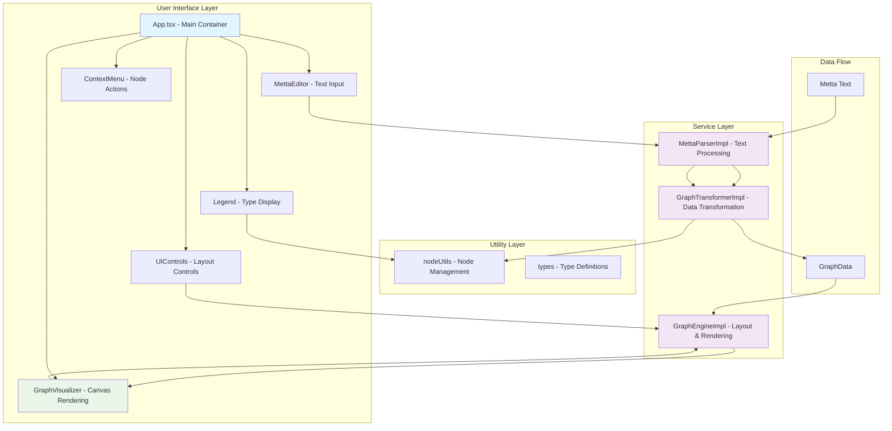
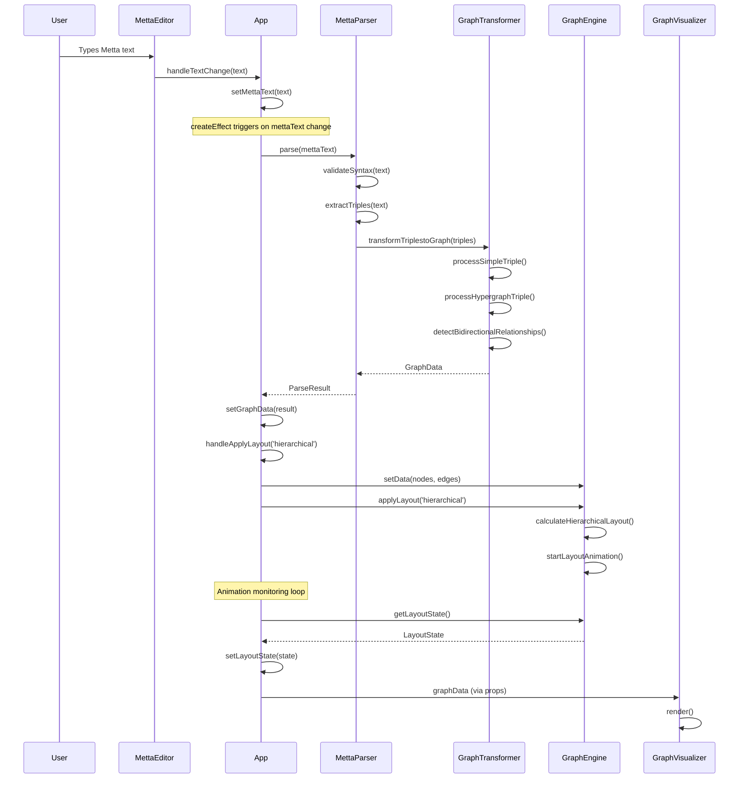
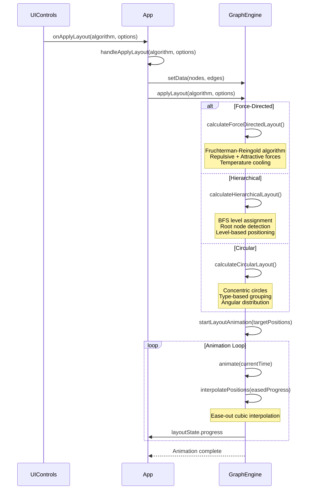
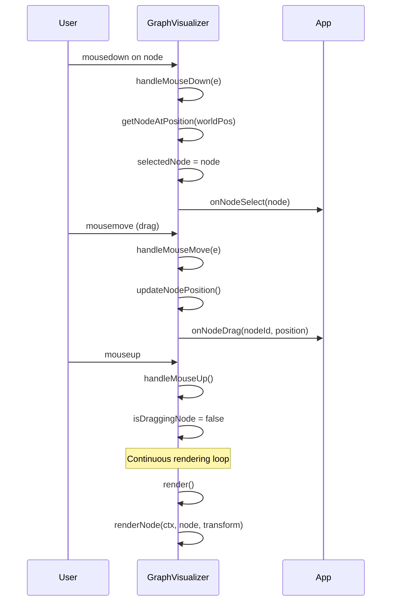

# AtomSpace Visualizer - Comprehensive Technical Documentation

A sophisticated web-based visualization tool for Metta knowledge bases, built with SolidJS and TypeScript. This document provides an in-depth technical walkthrough of the system architecture, component interactions, and function call flows.

## Table of Contents

1. [System Overview](#system-overview)
2. [Architecture Diagram](#architecture-diagram)
3. [Component Breakdown](#component-breakdown)
4. [Data Flow Analysis](#data-flow-analysis)
5. [Function Call Flows](#function-call-flows)
6. [Key Algorithms](#key-algorithms)
7. [Getting Started](#getting-started)
8. [API Reference](#api-reference)

## System Overview

The AtomSpace Visualizer is a reactive web application that transforms Metta knowledge base expressions into interactive graph visualizations. The system processes textual Metta expressions through a parsing pipeline, converts them to graph data structures, applies layout algorithms, and renders them on an interactive canvas.

### Core Features
- **Real-time Metta parsing** with syntax validation and error reporting
- **Interactive graph visualization** with zoom, pan, and node manipulation
- **Multiple layout algorithms**: Force-directed, Hierarchical, and Circular
- **Dynamic UI positioning** with responsive floating panels
- **Export capabilities** for PDF and PNG formats
- **Hypergraph support** for complex relationship structures

## Architecture Diagram



## Component Breakdown

### 1. App.tsx - Main Application Container

**Purpose**: Central orchestrator managing all application state and component interactions.

**Key Responsibilities**:
- Global state management (graph data, UI states, layout states)
- Event handling coordination between components
- Dynamic UI positioning calculations
- Automatic layout application on data load

**Critical Functions**:
```typescript
// Main parsing and graph generation pipeline
createEffect(() => {
  if (mettaText().trim()) {
    const parseResult = parser.parse(mettaText());
    const scaledNodes = parseResult.nodes.map(node => ({...}));
    setGraphData({...});
    if (scaledNodes.length > 0) {
      handleApplyLayout('hierarchical'); // Auto-apply hierarchical layout
    }
  }
});

// Layout application with monitoring
const handleApplyLayout = (algorithm: LayoutAlgorithm, options?: LayoutOptions) => {
  graphEngine.setData(currentGraphData.nodes, currentGraphData.edges);
  graphEngine.applyLayout(algorithm, options);
  const monitorLayout = () => {
    const state = graphEngine.getLayoutState();
    setLayoutState(state);
    if (state.isAnimating) requestAnimationFrame(monitorLayout);
  };
  monitorLayout();
};

// Dynamic legend positioning relative to controls
const getLegendBottomPosition = () => {
  const controlsElement = document.getElementById('controls-card');
  if (controlsElement) {
    const rect = controlsElement.getBoundingClientRect();
    return window.innerHeight - rect.top + 5; // 5px margin
  }
  return isControlsMinimized() ? 75 : 245;
};
```

### 2. MettaParserImpl - Text Processing Engine

**Purpose**: Converts raw Metta text into structured graph data through multi-stage parsing.

**Processing Pipeline**:
```typescript
parse(mettaText: string): ParseResult {
  // Stage 1: Syntax validation
  const validation = this.validateSyntax(mettaText);
  
  // Stage 2: Triple extraction
  const triples = this.extractTriples(mettaText);
  
  // Stage 3: Graph transformation
  const graphData = this.graphTransformer.transformTriplestoGraph(triples);
  
  return { nodes: graphData.nodes, edges: graphData.edges, ... };
}

// Expression parsing with nested structure support
private parseExpression(expression: string): ParsedExpression | null {
  const tokens = this.tokenize(content);
  const predicate = tokens[0];
  const args: (string | ParsedExpression)[] = [];
  
  for (let i = 1; i < tokens.length; i++) {
    const token = tokens[i];
    if (token.charAt(0) === '(' && token.charAt(token.length - 1) === ')') {
      const nested = this.parseExpression(token); // Recursive parsing
      if (nested) args.push(nested);
    } else {
      args.push(token);
    }
  }
  return { predicate, args };
}
```

### 3. GraphTransformerImpl - Data Structure Conversion

**Purpose**: Transforms parsed triples into graph nodes and edges with proper positioning and relationships.

**Key Transformation Methods**:
```typescript
transformTriplestoGraph(triples: Triple[]): GraphData {
  const nodes: GraphNode[] = [];
  const edges: GraphEdge[] = [];
  const hypergraphs: HypergraphStructure[] = [];

  for (let index = 0; index < triples.length; index++) {
    const triple = triples[index];
    
    if (triple.isHypergraph) {
      this.processHypergraphTriple(triple, nodes, edges, hypergraphs, index);
    } else {
      this.processSimpleTriple(triple, nodes, edges, index);
    }
  }
  
  return {
    nodes,
    edges: this.detectBidirectionalRelationships(edges),
    hypergraphs,
    metadata: this.createGraphMetadata(nodes, edges, hypergraphs)
  };
}

// Hypergraph processing with intermediate nodes
processHypergraphTriple(triple: Triple, nodes: GraphNode[], edges: GraphEdge[], ...) {
  const allEntities = [...subjects, ...objects];
  const centerX = 0, centerY = index * 150;
  const radius = Math.max(80, allEntities.length * 20);

  // Circular arrangement around center
  const entityNodes = allEntities.map((entity, i) => {
    const angle = (2 * Math.PI * i) / allEntities.length;
    const x = centerX + radius * Math.cos(angle);
    const y = centerY + radius * Math.sin(angle);
    return createOrUpdateNode(nodes, entity, { x, y });
  });

  // Create intermediate node at center
  const intermediateNode = this.createIntermediateNode(triple.predicate, counter, {centerX, centerY});
  this.createHypergraphConnections(entityNodes, intermediateNode, triple, edges);
}
```

### 4. GraphEngineImpl - Layout and Rendering Engine

**Purpose**: Handles graph layout algorithms, smooth animations, and canvas rendering.

**Layout Algorithms**:

#### Force-Directed Layout (Fruchterman-Reingold)
```typescript
private calculateForceDirectedLayout(options: Required<LayoutOptions>): Map<string, Point> {
  const positions = new Map<string, Point>();
  const velocities = new Map<string, Point>();
  
  let temperature = area / 10;
  const cooling = temperature / options.iterations;

  for (let iteration = 0; iteration < options.iterations; iteration++) {
    // Repulsive forces between all node pairs
    for (let i = 0; i < this.nodes.length; i++) {
      for (let j = i + 1; j < this.nodes.length; j++) {
        const repulsiveForce = options.repulsionStrength / (distance * distance);
        const fx = (dx / distance) * repulsiveForce * 20;
        // Apply forces to velocities...
      }
    }
    
    // Attractive forces for connected nodes
    this.edges.forEach(edge => {
      const attractiveForce = (distance * distance) / options.springLength * options.springStrength;
      // Apply spring forces...
    });
    
    // Update positions with temperature cooling
    temperature = Math.max(0.1, temperature - cooling);
  }
  
  return this.centerLayoutPositions(positions);
}
```

#### Hierarchical Layout
```typescript
private calculateHierarchicalLayout(options: Required<LayoutOptions>): Map<string, Point> {
  // Build hierarchy using BFS from root nodes
  const inDegree = new Map<string, number>();
  const levels = new Map<string, number>();
  const queue: string[] = [];
  
  // Find root nodes (no incoming edges)
  this.nodes.forEach(node => {
    if (inDegree.get(node.id) === 0) {
      levels.set(node.id, 0);
      queue.push(node.id);
    }
  });
  
  // BFS level assignment
  while (queue.length > 0) {
    const currentNode = queue.shift()!;
    const currentLevel = levels.get(currentNode)!;
    
    this.edges.forEach(edge => {
      if (edge.source === currentNode && !visited.has(edge.target)) {
        levels.set(edge.target, currentLevel + 1);
        queue.push(edge.target);
      }
    });
  }
  
  // Position nodes by level
  const levelHeight = 170;
  levelGroups.forEach((nodeIds, level) => {
    const y = (level - maxLevel / 2) * levelHeight;
    nodeIds.forEach((nodeId, index) => {
      const x = startX + index * nodeWidth + nodeWidth / 2;
      positions.set(nodeId, { x, y });
    });
  });
}
```

#### Animation System
```typescript
private startLayoutAnimation(algorithm: LayoutAlgorithm, targetPositions: Map<string, Point>, duration: number) {
  const startTime = performance.now();
  const initialPositions = new Map<string, Point>();
  
  this.nodes.forEach(node => {
    initialPositions.set(node.id, { ...node.position });
  });

  const animate = (currentTime: number) => {
    const elapsed = currentTime - startTime;
    const progress = Math.max(0, Math.min(elapsed / duration, 1));
    
    // Easing function (ease-out cubic)
    const easedProgress = 1 - Math.pow(1 - progress, 3);
    
    // Interpolate positions
    this.nodes.forEach(node => {
      const initial = initialPositions.get(node.id);
      const target = targetPositions.get(node.id);
      
      if (initial && target) {
        node.position.x = initial.x + (target.x - initial.x) * easedProgress;
        node.position.y = initial.y + (target.y - initial.y) * easedProgress;
      }
    });

    if (progress < 1 && this.layoutState.isAnimating) {
      this.animationFrameId = requestAnimationFrame(animate);
    }
  };
  
  this.animationFrameId = requestAnimationFrame(animate);
}
```

### 5. GraphVisualizer - Interactive Canvas Component

**Purpose**: Provides interactive canvas-based graph rendering with zoom, pan, and node manipulation.

**Interaction System**:
```typescript
const handleMouseDown = (e: MouseEvent) => {
  const mousePos = getMousePos(e);
  const worldPos = screenToWorld(mousePos);
  const node = getNodeAtPosition(worldPos);
  
  if (node) {
    // Node interaction mode
    selectedNode = node;
    isDraggingNode = true;
    draggedNode = node;
    dragOffset = {
      x: worldPos.x - node.position.x,
      y: worldPos.y - node.position.y
    };
  } else {
    // Canvas panning mode
    isPanning = true;
    lastPanPoint = mousePos;
  }
};

const handleMouseMove = (e: MouseEvent) => {
  const mousePos = getMousePos(e);
  const worldPos = screenToWorld(mousePos);
  
  if (isDraggingNode && draggedNode) {
    // Update node position during drag
    const newPosition = {
      x: worldPos.x - dragOffset.x,
      y: worldPos.y - dragOffset.y
    };
    draggedNode.position = newPosition;
    props.onNodeDrag(draggedNode.id, newPosition);
  } else if (isPanning) {
    // Pan the canvas
    const dx = mousePos.x - lastPanPoint.x;
    const dy = mousePos.y - lastPanPoint.y;
    transform.x += dx;
    transform.y += dy;
  }
};
```

**Rendering Pipeline**:
```typescript
const render = () => {
  const ctx = canvasRef.getContext('2d');
  ctx.clearRect(0, 0, canvasRef.width, canvasRef.height);
  
  // High-quality rendering setup
  ctx.imageSmoothingEnabled = true;
  ctx.imageSmoothingQuality = 'high';

  // Render background grid if zoomed in
  if (transform.scale > 0.3) drawGrid(ctx);

  // Render edges first (behind nodes)
  props.graphData.edges.forEach(edge => renderEdge(ctx, edge, transform));
  
  // Render nodes with z-order management
  const regularNodes = props.graphData.nodes.filter(n => n !== selectedNode && n !== draggedNode);
  const priorityNodes = props.graphData.nodes.filter(n => n === selectedNode || n === draggedNode);
  
  regularNodes.forEach(node => renderNode(ctx, node, transform));
  priorityNodes.forEach(node => renderNode(ctx, node, transform)); // On top
};
```

## Data Flow Analysis

### 1. Text Input to Graph Visualization Flow



### 2. Layout Algorithm Application Flow



### 3. Interactive Node Manipulation Flow



## Key Algorithms

### 1. Metta Expression Parsing Algorithm

```typescript
// Tokenization with nested parentheses support
private tokenize(content: string): string[] {
  const tokens: string[] = [];
  let current = '';
  let parenDepth = 0;
  let inToken = false;

  for (let i = 0; i < content.length; i++) {
    const char = content[i];

    if (char === '(') {
      parenDepth++;
      current += char;
      inToken = true;
    } else if (char === ')') {
      parenDepth--;
      current += char;
      if (parenDepth === 0 && inToken) {
        tokens.push(current.trim());
        current = '';
        inToken = false;
      }
    } else if (char === ' ' && parenDepth === 0) {
      if (current.trim()) {
        tokens.push(current.trim());
        current = '';
      }
      inToken = false;
    } else {
      current += char;
      inToken = true;
    }
  }

  return tokens;
}
```

### 2. Dynamic UI Positioning Algorithm

```typescript
// Responsive legend positioning relative to controls card
const getLegendBottomPosition = () => {
  const controlsElement = document.getElementById('controls-card');
  if (controlsElement) {
    const rect = controlsElement.getBoundingClientRect();
    return window.innerHeight - rect.top;
  }
  // Fallback calculation
  return isControlsMinimized() ? 70 : 240;
};

const getLegendMaxHeight = () => {
  if (isLegendMinimized()) return '50px';
  const bottomPosition = getLegendBottomPosition();
  const topMargin = 100; // Space for title and other UI
  return `calc(100vh - ${bottomPosition + topMargin}px)`;
};
```

### 3. Color Generation Algorithm

```typescript
// Consistent color generation based on string hash
export function getNodeColor(label: string): string {
  let hash = 0;
  for (let i = 0; i < label.length; i++) {
    hash = label.charCodeAt(i) + ((hash << 5) - hash);
  }
  const hue = Math.abs(hash) % 360;
  return `hsla(${hue}, 65%, 70%, 0.7)`;
}

export function getEdgeColor(predicate: string): string {
  let hash = 0;
  for (let i = 0; i < predicate.length; i++) {
    hash = predicate.charCodeAt(i) + ((hash << 5) - hash);
  }
  const hue = (Math.abs(hash) + 180) % 360; // Offset for differentiation
  return `hsla(${hue}, 60%, 65%, 0.6)`;
}
```

## Getting Started

### Prerequisites
- Node.js (v16 or higher)
- npm or yarn

### Installation
```bash
npm install
```

### Development
```bash
npm run dev
```

### Build
```bash
npm run build
```

## API Reference

### Core Interfaces

```typescript
interface GraphData {
  nodes: GraphNode[];
  edges: GraphEdge[];
  metadata: GraphMetadata;
  hypergraphs: HypergraphStructure[];
}

interface GraphNode {
  id: string;
  label: string;
  type: NodeType;
  position: Point;
  color?: string;
  size?: number;
  isHypergraph?: boolean;
  metadata: {
    originalExpression?: string;
    occurrences?: number;
    isGenerated?: boolean;
  };
}

interface LayoutOptions {
  iterations?: number;
  springLength?: number;
  springStrength?: number;
  repulsionStrength?: number;
  damping?: number;
  animationDuration?: number;
  centerForce?: number;
}
```

### Key Service Methods

```typescript
// MettaParserImpl
parse(mettaText: string): ParseResult
validateSyntax(mettaText: string): ValidationResult
extractTriples(mettaText: string): Triple[]

// GraphTransformerImpl
transformTriplestoGraph(triples: Triple[]): GraphData
processSimpleTriple(triple: Triple, nodes: GraphNode[], edges: GraphEdge[], index: number): void
processHypergraphTriple(triple: Triple, ...): void

// GraphEngineImpl
setData(nodes: GraphNode[], edges: GraphEdge[]): void
applyLayout(algorithm: LayoutAlgorithm, options?: LayoutOptions): void
render(ctx: CanvasRenderingContext2D, transform: Transform): void
getLayoutState(): LayoutState
```

## Performance Considerations

1. **Canvas Rendering Optimization**: Viewport culling for nodes and edges outside visible area
2. **Animation Performance**: RequestAnimationFrame-based smooth interpolation with easing
3. **Memory Management**: Proper cleanup of event listeners and animation frames
4. **Responsive Design**: Dynamic UI positioning with ResizeObserver for optimal layout

## Contributing

1. Fork the repository
2. Create a feature branch
3. Follow the established architecture patterns
4. Add comprehensive tests for new functionality
5. Update documentation for API changes
6. Submit a pull request

## License

MIT License